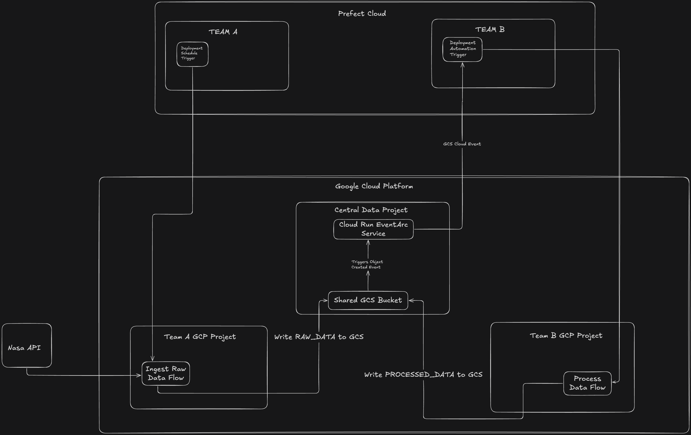

# Data Lake Workflow Automation

## Overview

This project automates the ingestion and processing of Near Earth Objects (NEO) data from NASA's API into an Google Cloud storage data lake using Prefect for orchestration. It comprises two main components: a data fetcher that retrieves and stores NEO data in GCS, and a listener that processes this data upon arrival. For This specific example I've split the processes into two different "teams" to illustrate how you might orchestrate workflows across isolated environments that share a central data store, this example is specific to separate workspaces in cloud but generally applies to any separation of environments.



## Components

- **requirements.txt**: Lists the project's Python dependencies
- **Dockerfile**: Specifies the Docker container configuration for running the application
- **teama/datalake_gcs_nasa.py**: Defines the flow to fetch NEO data from NASA's API and store it in GCS
- **teamb/datalake_listener.py**: Implements the flow to process new NEO data files added to GCS
- **cloud_run_emit_event_ex/custom_event.py**: Provides a simple example for setting up a cloud run function to pipe events to prefect

## Pre-Reqs

This guide assumes you've configured a cloud run service to pipe events to prefect cloud, I've provided a simple example of what the script might look like, for specific setup guidance reference gcp's cloud run docs [here](https://cloud.google.com/functions/docs).
Additionally this guide doesn't cover setting up a cloud run work-pool for details or assistance getting started with setting up a worker in GCP cloud run see the docs [here](https://docs.prefect.io/integrations/prefect-gcp/gcp-worker-guide)

## Setup

1. Installation setup

    a. Clone this repository:

    ```bash
    git clone https://github.com/PrefectHQ/examples.git
    cd flows/cross-workspace-flows/
    ```

    b. Set up a virtual environment (optional but recommended)

    ```bash
    python -m venv venv
    source venv/bin/activate  # On Windows use `venv\Scripts\activate`
    ```

    c. Install dependencies
    ```bash
    pip install -r requirements.txt
    ```
2. Ensure gcloud CLI is configured with the necessary access rights
3. Install Docker and ensure it's running
4. set the PREFECT_API_URL, PREFECT_API_KEY, IMAGE_TAG, WORKPOOL_NAME, and SCHEDULES_ACTIVE env variables
    - optionally you can setup a .env file for each team in their respective projects, i.e. **teama** and **teamb** see the **.env-ex** file for an example or checkout the docs [here](https://docs-3.prefect.io/v3/how-to-guides/configuration/manage-settings#configure-settings-for-a-project)

## Dependencies

- Prefect: For workflow orchestration
- Google Cloud SDK: For interactions with GCS services
- HTTPX & Pendulum: For making API requests and handling dates

## Deployment

Deployments are created from the **datalake_gcs_nasa.py** and **datalake_listener.py** for teama and teamb respectively, which sets up the flows and configurations needed for execution in GCP. Ensure that you have the necessary GCP permissions and configurations in place. 
